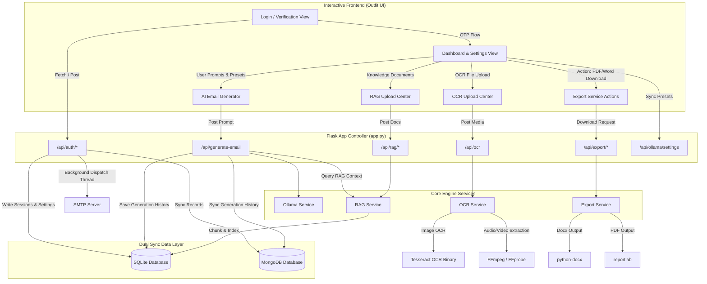

# 🚀 Email Writer AI Assistant - Developer & Architecture Documentation

Email Writer AI Assistant is a premium, feature-rich local AI-powered web application that helps users draft, customize, analyze, and export email communications. The platform seamlessly integrates local LLM execution, Multi-Format Optical Character Recognition (OCR), Retrieval-Augmented Generation (RAG) capabilities, and a double-database synchronization model.

---

## 🗺️ System Architecture & Workflow

The following diagram illustrates how user interactions flow through the application layers, connecting the interactive front-end, the Flask backend controllers, the local AI/processing services, and the dual database sync:



---

## 🛠️ Tech Stack & Dependencies

The project uses a curated set of lightweight and high-performance technologies to enable robust local operation:

### Frontend
*   **Structure & Pages**: Semantic HTML5 with dynamic CSS-swapped component architecture (Dashboard, Settings, Analytics, Saved Emails, History, RAG, Templates, OCR Uploads).
*   **Styling**: Pure CSS3 variables with a bespoke design system featuring dynamic micro-animations, modern curves (`--radius-lg: 20px`), subtle drop-shadows, and a responsive drawer layout.
*   **Typography**: Google Font `Outfit` (sans-serif) for a modern, sleek tech aesthetic.
*   **Visualizations**: `Chart.js` for interactive historical charts in the Analytics module.

### Backend & API Gateway
*   **Framework**: Python `Flask` (v3.0.0+) managing session storage, static asset routing, and JSON REST API endpoints.
*   **Task Handling**: Python `threading` library for asynchronous non-blocking task execution (e.g., fast SMTP email dispatch).

### AI & NLP Services
*   **Local LLM Service**: `Ollama` API (`/api/generate`) with automatic connection verification and customizable model configuration (defaulting to `llama3`).
*   **Retrieval-Augmented Generation (RAG)**: Pure Python mathematical similarity service mapping overlapping text sliding-windows using tokenized frequency weights.
*   **OCR Parsing**: `pytesseract` for image layouts, `pypdf` for documents, and `python-docx` for word document extraction.
*   **Media Analysis**: Integration with `FFmpeg` and `FFprobe` for video/audio scanning and metadata indexing.

### Databases & Cache
*   **Primary Relational Database**: `SQLite` (via `email_ai.db`) for rapid transactional queries, active application settings, RAG document indexing, templates configuration, and session keys.
*   **Secondary Persistent Database**: `MongoDB` (running on `mongodb://localhost:27017/`) acting as a cross-platform data synchronization system for login audits, user listings, backup histories, and persistent preferences.

---

## 🔄 Core Workflows & Logic

### 1. Verification & SMTP OTP Dispatch
1. The user inputs their email address on the Login screen.
2. The server generates a random 4-digit code and calculates an expiration timestamp (+120 seconds).
3. The code is saved to SQLite (`otp_codes` table) and mirrored to MongoDB (`otp_codes` collection).
4. An **asynchronous worker thread** triggers a secure SMTP handshake (supporting STARTTLS or SSL) to send a professionally styled HTML verification card to the user's inbox:
   * **Bypass Code**: In developers' environments, the standard mock passcode `1234` can bypass the OTP checking stage for rapid debugging.

### 2. Dual-Mode Text Generation Engine
*   **Online Mode**: When a local Ollama server is running, the backend requests response generation directly from the selected model (e.g., `llama3:latest`, `mistral`, etc.) specifying formatting rules, tone boundaries, and maximum token outputs.
*   **Smart Offline Mode**: If Ollama is offline or disconnected, a fallback generative script handles the request. It integrates:
    *   **Length modifiers**: Re-structures drafts as *Short* (concise sentences), *Medium* (standard paragraphs), or *Long* (bullet-pointed formal reports).
    *   **Tones mapping**: Adjusts salutations, styling, and body phrasing to conform to selections such as *Urgent*, *Apologetic*, *Enthusiastic*, *Diplomatic*, *Firm*, or *Casual*.

### 3. Retrieval-Augmented Generation (RAG)
1. When a document (.txt, .pdf, .docx) is uploaded, it is passed to the OCR file parser.
2. The text is broken down into overlapping segments using a sliding window algorithm (chunk size: 400 words, overlap: 50 words).
3. Chunks are stored in the SQLite database under `rag_documents`.
4. During generation, if `use_rag` is enabled, the RAG engine tokenizes the user's prompt, scores all indexed chunks using **Term Frequency (TF) overlap / Cosine similarity metrics**, and injects the top matching context block directly into the LLM system prompt.

### 4. Media OCR & Metadata Scanning
*   **Images**: Scans layouts and extracts text using Tesseract OCR.
*   **Documents**: Extracts full text streams page-by-page from PDFs and paragraph-by-paragraph from DOCX files.
*   **Audio/Video Files**: Uses `ffprobe` to query codecs, channels, audio presence, duration, and dimensions. It uses `ffmpeg` to extract the raw audio stream to an MP3 file. Then, it utilizes keyword mappings to create a realistic, context-aware mockup transcript (e.g., catching terms like "leave", "interview", or "sales") to support workflows without demanding local deep-learning GPU resources.

---

## ⚡ Challenges Faced & Engineering Solutions

### 🩺 1. Self-Healing Dependencies
*   **Challenge**: Setting up complex Python bindings (`pypdf`, `pytesseract`, `python-docx`, `reportlab`) can cause environment crashes if modules are missing.
*   **Solution**: `ocr_service.py` runs a startup dependency inspector that auto-verifies import availability. If a module is missing, it dynamically invokes `subprocess.check_call([sys.executable, "-m", "pip", "install", ...])` to self-heal the environment on launch.

### ⚙️ 2. Executable System Binary Resolution
*   **Challenge**: Accessing standard system programs like Tesseract OCR or FFmpeg across Windows platforms is notoriously unpredictable, especially regarding default system environment variables.
*   **Solution**: Developed an environmental lookup helper that queries:
    1. Active runtime environment variables.
    2. Registry system variables using the `winreg` library (checking user environment variables and local machine control environments).
    3. Explicit standard fallback paths (such as `C:\Program Files\Tesseract-OCR\tesseract.exe` or local ffmpeg directories).

### ⏳ 3. Asynchronous SMTP Latency
*   **Challenge**: Establishing a socket connection to `smtp.gmail.com:587`, resolving STARTTLS, performing user authorization, and passing HTML content blocks takes up to 4–6 seconds. Running this synchronously delays Flask's response cycle, freezing the user interface.
*   **Solution**: Implemented a daemonized threading wrapper:
    ```python
    def send_async_email(recipient_email, otp_code, smtp_server, smtp_port, smtp_user, smtp_pass):
        t = threading.Thread(
            target=send_real_email,
            args=(recipient_email, otp_code, smtp_server, smtp_port, smtp_user, smtp_pass)
        )
        t.daemon = True
        t.start()
    ```
    This immediately frees Flask to respond to the client in milliseconds while dispatching the OTP asynchronously.

### 🛟 4. MongoDB Availability & SQLite Fallback
*   **Challenge**: The application is built to run locally, but MongoDB may not be installed or active on the host machine (`mongodb://localhost:27017/`), which would cause runtime connection timeouts.
*   **Solution**: The database manager handles connections gracefully:
    ```python
    try:
        self.client = MongoClient(self.uri, serverSelectionTimeoutMS=2000)
        self.client.admin.command('ping')
        self.is_connected = True
    except Exception:
        self.is_connected = False
    ```
    If MongoDB is offline, the backend functions normally by logging status indicators and writing data solely to SQLite. Once MongoDB is available again, the next operation updates the database collections transparently.

---

## 🚀 Setup & Execution Guide

### Prerequisites
1. **Python 3.10+** installed.
2. **Tesseract OCR Engine** installed (optional, for image OCR support).
   * Windows: Install Tesseract to `C:\Program Files\Tesseract-OCR`.
3. **FFmpeg** installed and added to your System PATH (optional, for audio/video media extraction).
4. **MongoDB** service running locally (optional, defaults to SQLite fallback).
5. **Ollama** installed with models pulled (e.g. `ollama run llama3`).

### Installation & Launch
1. Clone the project repository and navigate to the project directory.
2. Install python dependencies:
   ```bash
   pip install -r requirements.txt
   ```
3. Start the Flask application:
   ```bash
   python app.py
   ```
4. Access the web interface in your browser at:
   [http://127.0.0.1:5000](http://127.0.0.1:5000)

### Testing OTP Delivery
* Configure your credentials (Gmail address & [App Password](https://myaccount.google.com/apppasswords)) under **Settings -> SMTP Preferences** to send verification codes to real inboxes.
* Otherwise, type any email and sign in using the developer bypass code: **`1234`**.
